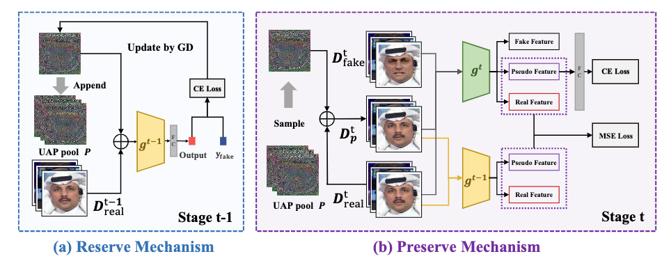

# Continual Face Forgery Detection via Historical Distribution Preserving. 
This repository is the official implementation of "Continual Face Forgery Detection via Historical Distribution Preserving."


## Dependencies and Installation

### Environment

- Python 3 (Recommend to use Anaconda)
- PyTorch >= 1.0
- NVIDIA GPU + CUDA (Need at least 15G GPU memory)

Before run the code, you should run

```shell
$ pip install -r requirements.txt
```
## Dataset
This code is mainly focus on :
Faceforensics++ (four subsets contains Deepfakes, Face2Face, FaceSwap, NeuralTextures), CELEB-DF, DFDC and WildDeepfake.
And change the data_root in configs/test.yaml and configs/train_hdp.yaml for each dataset. Here we give the example for Protocol 1. For other Protocols or other continue setting,
you can add your own dataloader.py and change the train_hdp.yaml.

As for the Faceforensics++, you should extract face using face detector and prepare the folder as follows:
```
├── faceforensics++
  └──manipulated_sequences
    ├──Deepfakes
      └──c23
          ├──000_003
            ├──000_003_0000.png
            ├──000_003_0001.png
            ├──...
          ├──001_870
          └── ...
    ├──Face2Face
    ├──FaceSwap
    ├──NeuralTextures

  └──original_sequences
    └──youtube
      └──c23
          ├──000
            ├──000_0000.png
            ├──000_0001,png
            ├──...
          ├──001
          └── ...
```


## Train
The training and testing config is written in configs/train_hdp.yaml and configs/test.yaml. Before training, you can change the hyperparameters as you need.
Then run 
```
CUDA_VISIBLE_DEVICES=x python3 train.py -c configs/train_hdp.yaml
```
to train the model.
The id, model, log, generated UAP are saved in folder "wandb" automatically.

You can run 
```
CUDA_VISIBLE_DEVICES=x python3 train_baseline.py -c configs/train_hdp.yaml
```
to get sequence finetune result as baseline.


## Test
After training, you can run 
```
CUDA_VISIBLE_DEVICES = DEV_ID python3 test.py --exam_id XXX -c configs/test.yaml
```
to evaluate the final stage model with specific id on all testsets.


## Cite

If you are interested in this work, please cite our [paper](https://arxiv.org/abs/2308.06217)
```
@article{sun2023continual,
  title={Continual Face Forgery Detection via Historical Distribution Preserving},
  author={Sun, Ke and Chen, Shen and Yao, Taiping and Sun, Xiaoshuai and Ding, Shouhong and Ji, Rongrong},
  journal={arXiv preprint arXiv:2308.06217},
  year={2023}
}
```
